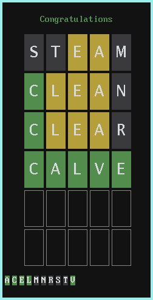

# nordle
A [Wordle](https://www.powerlanguage.co.uk/wordle/) game clone for [9front](http://9front.org).



Use your keyboard to input a word, backspace to remove last entered character and enter to validate your choice.  
Letters are coloured as follows:
- green if the letter is at the right position
- orange if the letter appears in the word but at a different position
- dark gray if the letter does not appear in the word

## Usage
```sh
% mk install
% games/nordle <wordlist>
```

The provided wordlist file has been generated from `/lib/words`

## License
MIT

## Bugs
You tell me!

